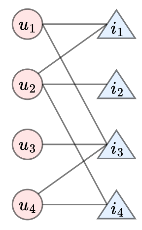

### 1. **整体框架**
   - **输入**：
     - 用户-物品交互图（结构信息）。
     - 用户和物品的特征信息（如用户画像、物品属性等）。
   - **输出**：
     - 个性化推荐列表。

   - **核心思想**：
     - 使用Hodge分解捕捉图的全局结构信息（如环路和流）。
     - 结合节点特征信息（如用户偏好、物品属性）进行个性化推荐。
     - 通过图神经网络（GNN）或其他模型将结构和特征信息融合。

---

### 2. **具体步骤**

#### **步骤1：构建用户-物品图**
   - 将用户和物品作为节点，用户与物品的交互（如点击、购买、评分等）作为边。
   - 边的权重可以表示交互的强度（如评分高低、点击次数等）。
   - 如果数据稀疏，可以通过添加虚拟边（如基于用户相似性或物品相似性）增强图的稠密性。

#### **步骤2：应用Hodge分解**
   - 对用户-物品图的流（flow）进行Hodge分解，得到梯度流、旋度流和调和流。
   - **调和流**：捕捉用户和物品之间的全局环路结构，反映潜在的高阶关系。
   - **梯度流**：反映局部的非循环结构，可能表示用户和物品之间的直接关联。
   - **旋度流**：反映局部的三角形环路，可能表示用户群体或物品类别的局部聚集。

#### **步骤3：提取节点特征**
   - **用户特征**：如年龄、性别、历史行为、兴趣标签等。
   - **物品特征**：如类别、价格、描述文本、图像等。
   - 使用特征工程或预训练模型（如BERT、ResNet）将文本或图像特征转换为向量。

#### **步骤4：融合结构和特征信息**
   - **方法1：基于图神经网络（GNN）的融合**：
     - 将Hodge分解的结果（如调和流的维度）作为图的全局特征，输入到GNN中。
     - 使用GNN（如GAT、GraphSAGE）对用户-物品图进行节点嵌入，同时结合节点特征信息。
     - 通过多层GNN传播，融合局部结构（边信息）、全局结构（Hodge分解结果）和节点特征。
   - **方法2：基于矩阵分解的融合**：
     - 将Hodge分解的调和流信息作为正则化项，加入到矩阵分解的目标函数中。
     - 例如，在协同过滤的基础上，添加调和流的约束，使得具有全局环路的用户和物品在隐因子空间中更接近。
   - **方法3：基于注意力机制的融合**：
     - 使用注意力机制（如Transformer）动态加权Hodge分解的结果和节点特征。
     - 例如，对每个用户-物品对，计算其在不同环路结构（调和流）中的重要性，并结合节点特征生成最终推荐。

#### **步骤5：生成推荐**
   - 基于融合后的节点嵌入，计算用户和物品之间的相似度（如余弦相似度）。
   - 对每个用户，生成Top-K推荐列表。

---

### 3. **优势**
   - **全局与局部结合**：
     - Hodge分解捕捉全局环路结构，节点特征捕捉局部个性化信息，两者结合可以提升推荐的准确性。
   - **动态适应性**：
     - 如果用户-物品图是动态变化的，Hodge分解可以捕捉图的动态演化，结合GNN可以实现实时推荐。
   - **可解释性**：
     - Hodge分解的结果（如调和流）可以提供推荐的可解释性，例如“推荐这个物品是因为它与其他你喜欢的物品形成了环路”。

---

### 4. **挑战与解决方案**
   - **计算复杂度**：
     - Hodge分解和GNN的计算复杂度较高。
     - **解决方案**：使用近似算法（如随机Hodge分解）或分布式计算（如DGL、PyTorch Geometric）。
   - **特征稀疏性**：
     - 用户和物品的特征可能稀疏或不完整。
     - **解决方案**：使用预训练模型（如BERT、ResNet）提取高质量特征，或通过图嵌入补全缺失特征。
   - **冷启动问题**：
     - 对新用户或新物品，缺乏交互数据。
     - **解决方案**：利用节点特征（如用户画像、物品属性）进行冷启动推荐。

---

### 5. **示例流程**
   1. **输入**：
      - 用户-物品交互图（结构信息）。
      - 用户特征（如年龄、性别、兴趣标签）。
      - 物品特征（如类别、描述文本）。
   2. **Hodge分解**：
      - 对交互图进行Hodge分解，提取调和流、梯度流和旋度流。
   3. **特征提取**：
      - 使用BERT提取物品描述文本的嵌入，使用ResNet提取物品图像的嵌入。
   4. **GNN融合**：
      - 将Hodge分解结果和节点特征输入GNN，生成用户和物品的嵌入。
   5. **推荐生成**：
      - 计算用户嵌入与物品嵌入的相似度，生成Top-K推荐列表。

---

### 6. **总结**
通过将Hodge分解与节点特征信息结合，可以构建一个更完善的推荐系统。Hodge分解提供了全局的图结构信息，而节点特征提供了个性化的局部信息，两者结合可以显著提升推荐的准确性和可解释性。尽管存在计算复杂度和特征稀疏性等挑战，但通过合理的算法设计和优化，这一方案具有很大的潜力。